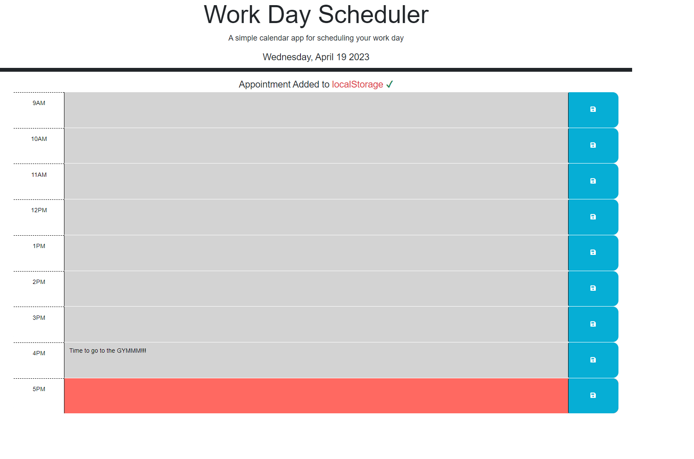

# Work Day Schedule

# Description

- The motivation behind this project was to help the user schedule his day
- I built this project to help users be productive with their time
- This project will help solve procrastination 
- Creating this project helped me improve my jQuery skills

# Usage 

- The date is displayed at the top of the page 
- User can edit the textarea and add events
- The events will be saved on localStorage and rendered on the calender
- When the event is saved, a notification will appear under the header

Link to deployed website: [https://0mar77.github.io/work-day-schedule/]

